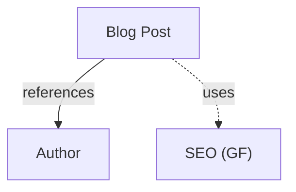
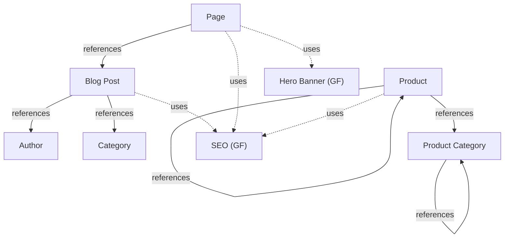

# Output Format Templates

Templates for each documentation output format. Use these as starting points and adapt to the project's needs.

---

## Model overview

### Template

```markdown
# Content Model Overview

## Content Types

| Name | UID | Fields | Description |
|------|-----|--------|-------------|
{{#each contentTypes}}
| {{title}} | `{{uid}}` | {{fields.length}} | {{description}} |
{{/each}}

## Global Fields

| Name | UID | Fields | Description |
|------|-----|--------|-------------|
{{#each globalFields}}
| {{title}} | `{{uid}}` | {{fields.length}} | {{description}} |
{{/each}}

## Summary

- **{{contentTypes.length}}** content types
- **{{globalFields.length}}** global fields
- **{{totalFields}}** total fields
```

### Example output

```markdown
# Content Model Overview

## Content Types

| Name | UID | Fields | Description |
|------|-----|--------|-------------|
| Author | `author` | 2 | Author profile |
| Blog Post | `blog_post` | 5 | A blog article with author and SEO |

## Global Fields

| Name | UID | Fields | Description |
|------|-----|--------|-------------|
| SEO | `seo` | 3 | Shared SEO metadata fields |

## Summary

- **2** content types
- **1** global fields
- **10** total fields
```

---

## Field inventory

### Template (per entity)

```markdown
## {{entity.title}} (`{{entity.uid}}`)

{{entity.description}}

**Kind:** {{entity.kind}}
**Dependencies:** {{entity.dependencies | join(", ")}}

| Field | UID | Type | Required | Unique | Multiple | Description |
|-------|-----|------|----------|--------|----------|-------------|
{{#each fields}}
| {{displayName}} | `{{uid}}` | {{kind}} | {{required}} | {{unique}} | {{multiple}} | {{description}} |
{{/each}}
```

### Example output

```markdown
## Blog Post (`blog_post`)

A blog article with author and SEO.

**Kind:** content_type
**Dependencies:** content_type:author, global_field:seo

| Field | UID | Type | Required | Unique | Multiple | Description |
|-------|-----|------|----------|--------|----------|-------------|
| Title | `title` | text | Yes | No | No | |
| Slug | `slug` | text | Yes | Yes | No | |
| Body | `body` | json | Yes | No | No | |
| Author | `author` | reference | Yes | No | No | References: author |
| SEO | `seo` | global_field | No | No | No | Uses: seo |
```

---

## Dependency diagram (Mermaid)

### Template

```mermaid
graph TD
{{#each contentTypes}}
  {{uid}}["{{title}}"]
{{/each}}
{{#each globalFields}}
  {{uid}}["{{title}} (GF)"]
{{/each}}

%% References
{{#each referenceEdges}}
  {{source}} -->|references| {{target}}
{{/each}}

%% Global field usage
{{#each globalFieldEdges}}
  {{source}} -.->|uses| {{target}}
{{/each}}
```

### Example output



### Styling tips

- Use solid arrows (`-->`) for content type references.
- Use dashed arrows (`-.->`) for global field usage.
- Append `(GF)` to global field labels to distinguish them.
- For large schemas, use `graph LR` (left-to-right) instead of `graph TD` (top-down).

### Complex example



---

## Content editor guide

### Template

```markdown
# Content Editor Guide

{{#each contentTypes}}
## {{title}}

{{description}}

### Required fields

These fields must be filled before publishing:

{{#each requiredFields}}
- **{{displayName}}**: {{description | default("(type: " + kind + ")")}}
{{/each}}

### Optional fields

{{#each optionalFields}}
- **{{displayName}}**: {{description | default("(type: " + kind + ")")}}
{{/each}}

{{#if references}}
### Related content

This content type links to:
{{#each references}}
- **{{displayName}}** → {{targetTitles | join(", ")}}
{{/each}}
{{/if}}

---
{{/each}}
```

### Example output

```markdown
# Content Editor Guide

## Blog Post

A blog article with author and SEO.

### Required fields

These fields must be filled before publishing:

- **Title**: The headline of the blog post
- **Slug**: URL-friendly identifier (must be unique)
- **Body**: The main content of the article
- **Author**: Select the author of this post

### Optional fields

- **SEO**: Search engine optimization metadata (meta title, description, etc.)

### Related content

This content type links to:
- **Author** → Author
- **SEO** → SEO (shared fields)

---

## Author

Author profile.

### Required fields

- **Name**: The author's full name

### Optional fields

- **Bio**: A short biography
```

---

## Generating from schema.json

To generate documentation from `schema.json`, follow this algorithm:

1. Parse `schema.json` and extract the `entities` array.
2. Separate entities by `kind`: `content_type` vs `global_field`.
3. For the **overview**: count fields per entity, collect titles and descriptions.
4. For the **field inventory**: iterate each entity's `fields` array.
5. For the **dependency diagram**: extract edges from `field.dependencies`:
   - If `dependency.kind === "reference"` → solid arrow to target entity
   - If `dependency.kind === "global_field"` → dashed arrow to target global field
6. For the **editor guide**: split fields into required vs optional, resolve reference target titles.

Sort content types before global fields. Within each group, sort alphabetically by title.
